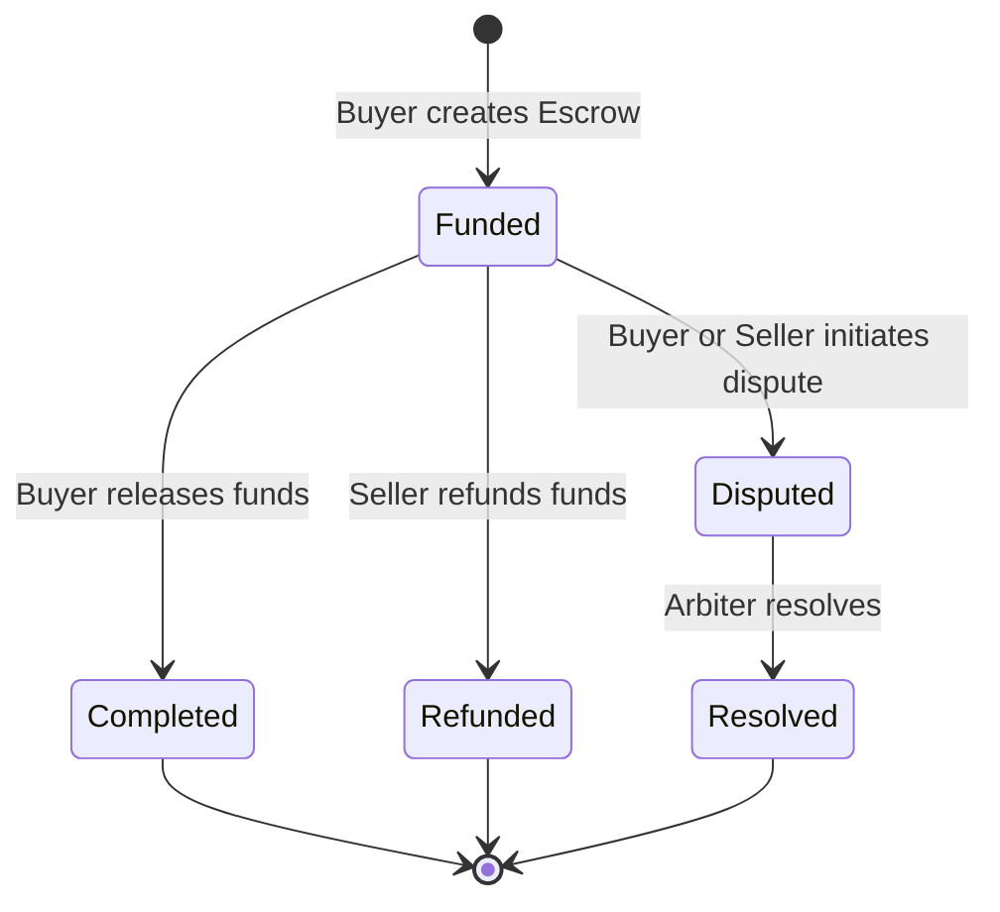
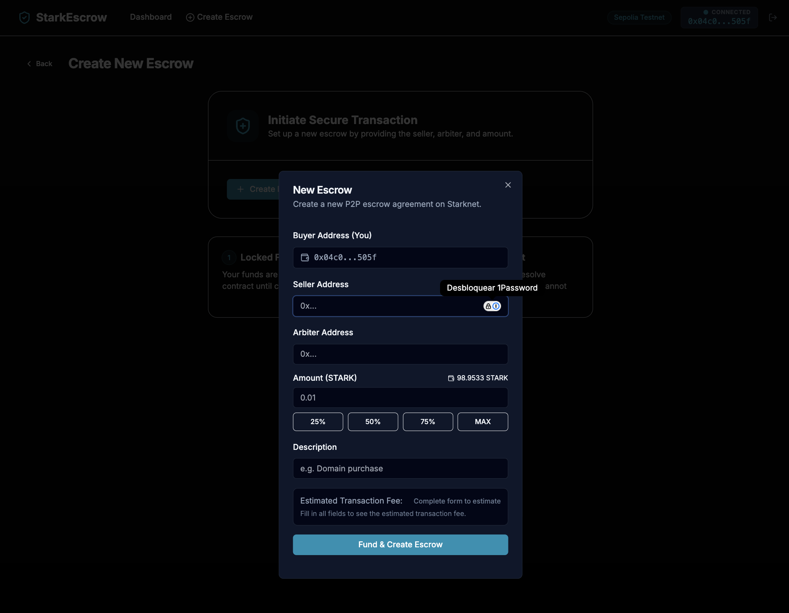
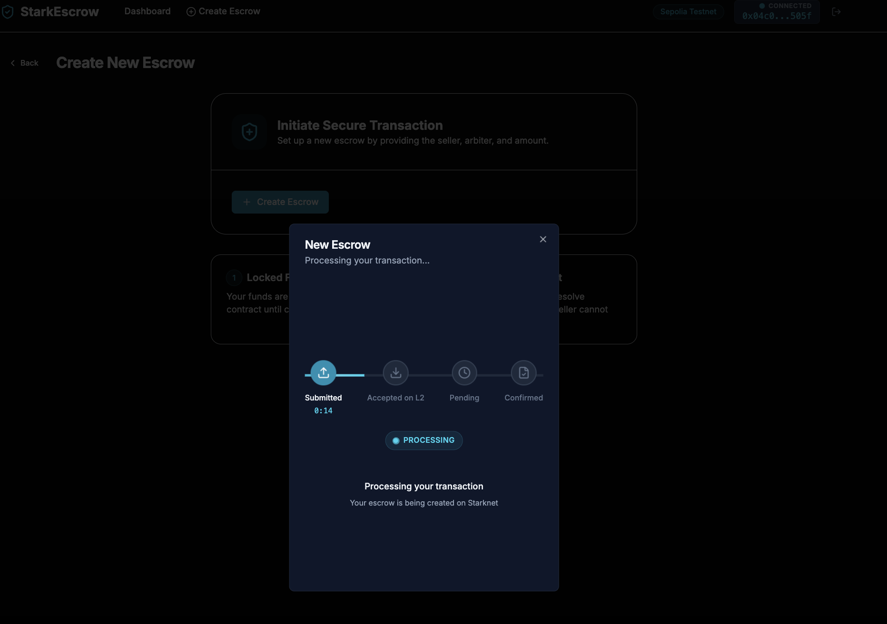
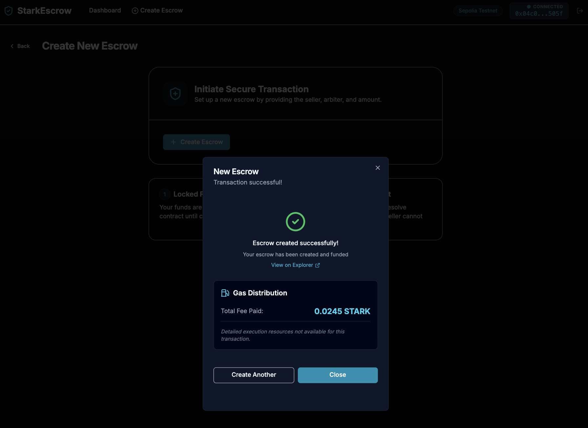

# 🔐 StarkEscrow - P2P Escrow on Starknet

## Overview

StarkEscrow is a decentralized peer-to-peer escrow service built on Starknet. it allows users to safely exchange goods or services by locking funds in a smart contract until the conditions of the trade are met. It supports buyer-led releases, seller-initiated refunds, and a robust dispute resolution mechanism facilitated by a neutral third-party arbiter.

## Features

- **Secure Escrow Creation**: Create an escrow with a STARK token deposit, specifying the seller and a neutral arbiter.
- **Buyer Release**: The buyer can release the funds to the seller once they are satisfied with the transaction.
- **Seller Refund**: The seller can refund the buyer at any time if they are unable to fulfill the request.
- **Dispute Mechanism**: Either party can raise a dispute if a conflict arises.
- **Arbiter Resolution**: A pre-selected arbiter can resolve disputes by deciding whether to release funds to the seller or refund the buyer.
- **Transparent Fees**: Automated fee collection for the platform owner.
- **ERC20 Token Support**: Uses STARK token on Starknet Sepolia for all escrow transactions.

## Architecture

- **Contracts**: Written in Cairo 2.x, deployed on Starknet Sepolia Testnet.
- **Frontend**: Built with Next.js 16, Tailwind CSS, and `starknet-react` for seamless wallet integration.
- **Safety**: Implements the Check-Effects-Interactions (CEI) pattern to ensure smart contract security.

## Escrow Flow

The following diagram illustrates the life cycle of an escrow and the possible state transitions:



For a detailed explanation of roles, actions, and fees, see the [Escrow Flow Documentation](docs/escrow_flow.md).

## Screenshots

### Dashboard


### Create Escrow


### Transaction Processing


### Success


## Getting Started

### Prerequisites

- **Node.js**: 18.x or higher
- **pnpm**: Fast, disk efficient package manager
- **Scarb**: The Cairo package manager
- **Rust & Cargo**: Required for certain Scarb plugins and Starknet Foundry
- **Starknet Foundry (snforge)**: For testing and contract management
- **Starkli**: The Starknet CLI for deployment

### Installation

```bash
# Clone the repository
git clone https://github.com/your-username/starkescrow.git
cd starkescrow

# Install dependencies
pnpm install

# Build the smart contracts
pnpm contracts:build

# Run smart contract tests
pnpm contracts:test

# Start the frontend development server
pnpm dev
```

### Deployment

To deploy your own version of the contract to Sepolia:

1.  **Configure Environment**: Set up your Starknet wallet using `starkli`. Ensure you have defined the `OWNER_ADDRESS` in your environment or `.env` file.
2.  **Execute Deployment**:

    ```bash
    # Option 1: Using the pnpm script (requires OWNER_ADDRESS env var)
    OWNER_ADDRESS=0x... pnpm contracts:deploy

    # Option 2: Running the script directly
    OWNER_ADDRESS=0x... ./contracts/scripts/deploy.sh
    ```

3.  **Connect Frontend**: Copy the resulting contract address into `frontend/src/lib/constants.ts` and `.env.example`.

## Usage

1. **Connect Wallet**: Use Argent or Braavos to connect to the Starknet Sepolia testnet.
2. **Get STARK Tokens**: Ensure you have STARK tokens in your wallet for creating escrows.
3. **Create Escrow**: Navigate to the "Create Escrow" page, fill in the seller and arbiter addresses, the amount in STARK, and a description. The frontend will automatically handle token approval.
4. **Manage Escrows**: View your active transactions on the Dashboard. Use the status-specific actions (Release, Refund, Dispute) to progress the escrow.

## Testing

The smart contract includes a comprehensive test suite covering:

- Correct state initialization in the constructor.
- Validation logic for escrow creation.
- Access control for sensitive operations (Release, Refund, Resolve).
- Proper fee calculation and withdrawal.

Run tests using:

```bash
pnpm contracts:test
```

### Troubleshooting

If you encounter the error `could not execute process: cargo fetch` while running tests or building, it means that **Rust and Cargo** are missing from your system. Scarb and Starknet Foundry require them to manage some internal components.

To fix this, install Rust using the official installer:

```bash
curl --proto '=https' --tlsv1.2 -sSf https://sh.rustup.rs | sh
```

Then, restart your terminal and try running the tests again.

## Security

- **CEI Pattern**: All state changes occur before any external calls.
- **Access Control**: Strict checks on who can call each function (buyer, seller, arbiter, owner).
- **Audit Status**: This project is for educational/demo purposes and has not been professionally audited.

## License

MIT
